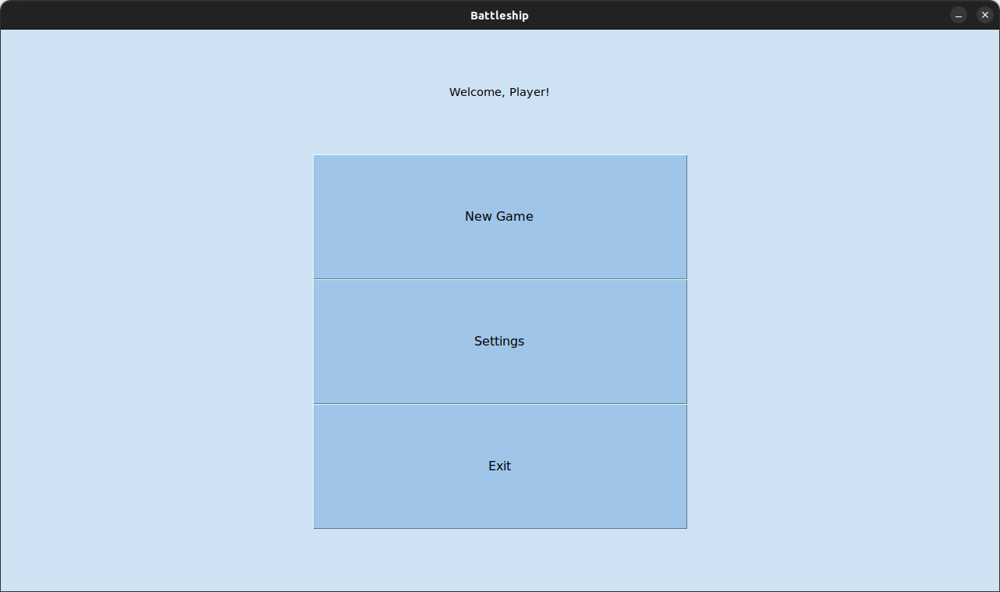

# battleship-game
Приложение для игры в морской бой с ботом локально или по сети с другим игроком.

### Правила
Игровое поле — квадрат 10×10 у каждого игрока, на котором размещается флот кораблей. Горизонтали нумеруются сверху вниз, а вертикали помечаются буквами слева направо.

Размещаются:
>- 1 корабль — ряд из 4 клеток («четырёхпалубный»; линкор)
>- 2 корабля — ряд из 3 клеток («трёхпалубные»; крейсера)
>- 3 корабля — ряд из 2 клеток («двухпалубные»; эсминцы)
>- 4 корабля — 1 клетка («однопалубные»; торпедные катера)

При размещении корабли не могут касаться друг друга сторонами и углами.

При выстреле в корабль противника, на чужом поле отмечается "попадание". До тех пор, пока есть хотя бы одна не пораженная клетка корабля, корабль на плаву. Если после выстрела все клетки корабля отмечены как "попадания" корабль считается потопленным, причем клетки с "попаданиями" для этого корабля перекрашиваются в другой цвет. Таким образом игрок всегда знает, потопил ли он корабль последним выстрелом или нет. После попадания игрок стреляет ещё раз. Игра продолжается до тех пор, пока у одного из игроков не останется кораблей на плаву. Как только будет произведен выстрел, потопивший последний корабль, игра заканчивается. Выигрывает игрок у которого остались не потопленные корабли.

### Пользовательский интерфейс:

Начальный экран:



Основная часть часть игры:


### Режимы игры
В игре представлено два режима:
- Сетевой
- Одиночный

При игре по сети каждый игрок подключается к серверу. Сервер составляет пары из игроков и запускает для каждой пары бой.

Одиночный режим предполагает игру с ботом, который случайно стреляет по полю игрока.

### Инструменты:
Для работы программы требуются следующие модули:
- tkinter
- asyncio
- Pillow
- pickle

### Сборка

- Для запуска тестов: `doit test`
- Для создания sphinx документации: `doit html`
- Сборка wheel `doit wheel`

### Запуск 

Требования: Python version >= 3.10

Запуск игры:
```sh
play-battleship
```
